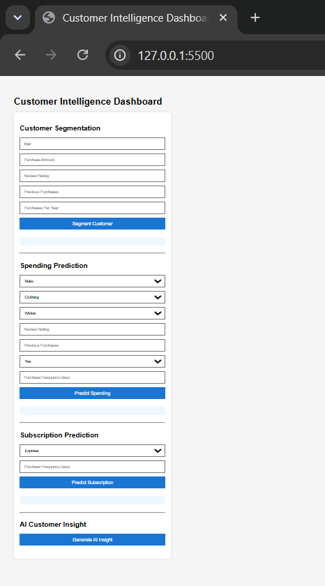
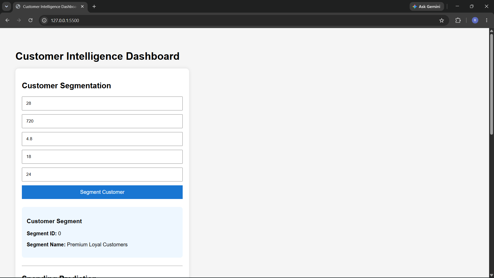
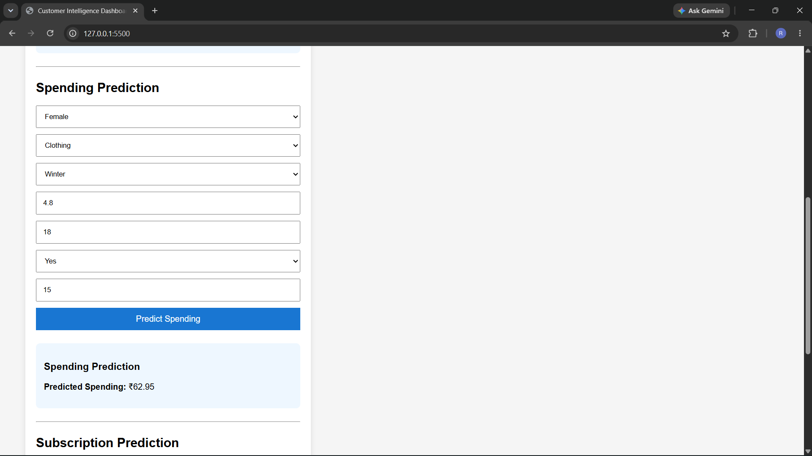
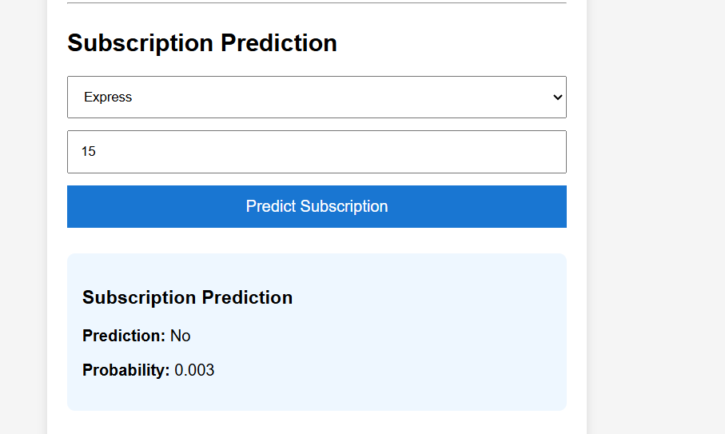
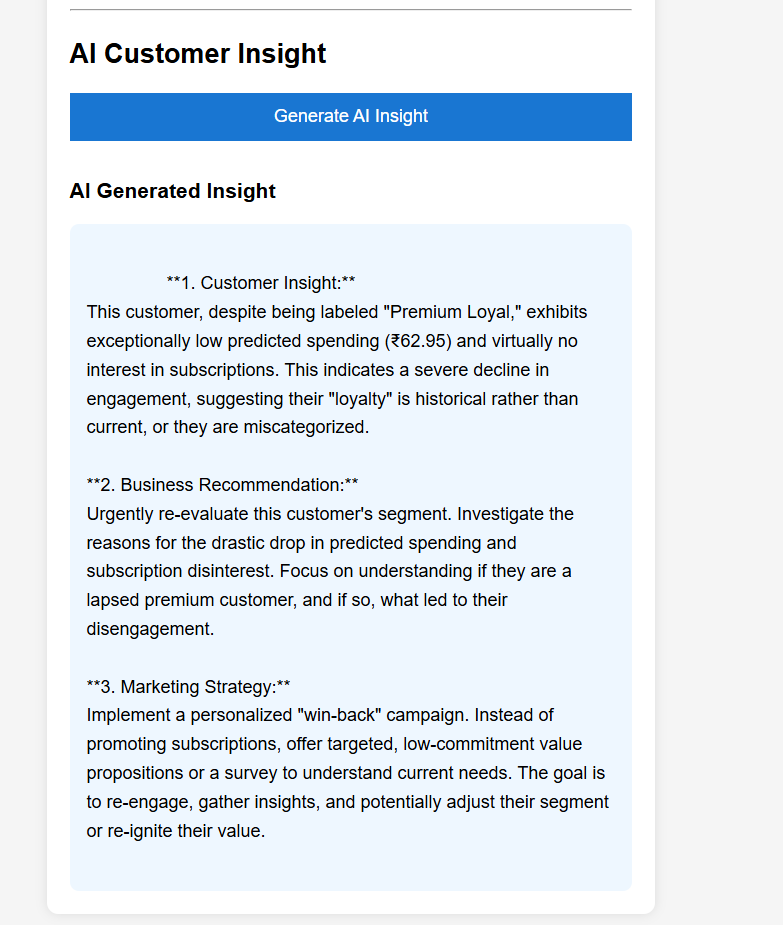
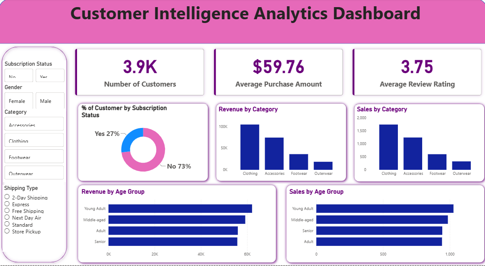

# Customer Intelligence Dashboard using Machine Learning, FastAPI & Generative AI

An end-to-end Customer Intelligence Dashboard that combines **Machine Learning**, **FastAPI**, **Google Gemini**, **Power BI**, and **Web Technologies** to transform customer shopping data into actionable business intelligence.

The system performs customer segmentation, spending prediction, subscription prediction, and AI-powered business insight generation through an interactive dashboard, enabling businesses to make data-driven decisions and improve customer engagement.

---

## Features

### Customer Segmentation
- K-Means Clustering
- Real-time customer segmentation
- Business-friendly segment labels

### Spending Prediction
- Linear Regression model
- Predicts expected customer spending
- Supports revenue forecasting

### Subscription Prediction
- Logistic Regression classifier
- Predicts subscription likelihood
- Generates subscription probability

### AI-Powered Business Insights
- Google Gemini API integration
- Customer insights
- Business recommendations
- Marketing strategies

### Interactive Dashboard
- HTML
- CSS
- JavaScript
- FastAPI backend
- Real-time predictions

### Business Intelligence
- Power BI Dashboard
- Interactive analytics
- Customer behaviour visualization
- Revenue analysis

---

# Application Preview

## Customer Intelligence Dashboard



---

## Customer Segmentation



---

## Spending Prediction



---

## Subscription Prediction



---

## AI-Powered Business Insight



---

## Power BI Dashboard



---

# Project Architecture

```text
                 Customer Shopping Dataset
                           │
                           ▼
        Data Preprocessing & Feature Engineering
                           │
         ┌─────────────────┼─────────────────┐
         ▼                 ▼                 ▼
 Customer Segmentation  Spending Prediction  Subscription Prediction
   (K-Means)          (Linear Regression)   (Logistic Regression)
         │                 │                 │
         └─────────────────┼─────────────────┘
                           ▼
                    FastAPI Backend
                           │
          ┌────────────────┼────────────────┐
          ▼                ▼                ▼
  REST API Endpoints  Frontend Dashboard  Google Gemini AI
                                      │
                                      ▼
                      AI Business Insights & Recommendations
                                      │
                                      ▼
                         Customer Intelligence Dashboard
```

---

# Project Structure

```text
Customer_Intelligence_Dashboard/
│
├── analytics/
│   ├── Customer_Intelligence_Dashboard.pbix
│   └── customer_analysis.sql
│
├── api/
│   ├── main.py
│   ├── test_api.py
│   ├── .env.example
│   └── requirements.txt
│
├── data/
│   ├── raw/
│   └── processed/
│
├── docs/
│   ├── Problem_Statement.pdf
│   ├── Project_Report.pdf
│   ├── Project_Presentation.pptx
│   └── screenshots/
│
├── frontend/
│   ├── index.html
│   ├── style.css
│   └── script.js
│
├── ml/
│   ├── data_preprocessing.py
│   ├── customer_segmentation.py
│   ├── spending_prediction.py
│   └── subscription_prediction.py
│
├── models/
│
├── notebooks/
│   └── customer_analysis.ipynb
│
├── README.md
├── LICENSE
├── requirements.txt
└── .gitignore
```

---

# Dataset

**Dataset Size**

- 3,900 Customer Records

**Features**

- Age
- Gender
- Purchase Amount
- Review Rating
- Previous Purchases
- Product Category
- Season
- Subscription Status
- Shipping Type
- Purchase Frequency

### Feature Engineering

- Purchase Frequency (Days)
- Purchases Per Year

---

# Machine Learning Models

| Task | Algorithm |
|------|-----------|
| Customer Segmentation | K-Means Clustering |
| Spending Prediction | Linear Regression |
| Subscription Prediction | Logistic Regression |
| Data Balancing | SMOTE |

---

# REST API Endpoints

| Method | Endpoint |
|---------|----------|
| GET | `/` |
| GET | `/model-status` |
| POST | `/segment-customer` |
| POST | `/predict-spending` |
| POST | `/predict-subscription` |
| POST | `/generate-insight` |

Swagger API Documentation:

```
http://127.0.0.1:8000/docs
```

---

# Technology Stack

## Programming Languages

- Python
- SQL
- JavaScript

## Backend

- FastAPI
- Uvicorn

## Machine Learning

- Scikit-Learn
- Pandas
- NumPy
- Imbalanced-Learn (SMOTE)
- Joblib

## Frontend

- HTML
- CSS
- JavaScript

## Generative AI

- Google Gemini API

## Business Intelligence

- Power BI

## Version Control

- Git
- GitHub

---

# Installation

## Clone Repository

```bash
git clone https://github.com/Ripunjay011/Customer_Intelligence_Dashboard.git

cd Customer_Intelligence_Dashboard
```

## Install Dependencies

```bash
pip install -r requirements.txt
```

## Configure Environment Variables

Create a `.env` file inside the **api** folder.

```env
GEMINI_API_KEY=YOUR_API_KEY
```

Example:

```env
GEMINI_API_KEY=AIzaSyXXXXXXXXXXXXXXXXXXXXXXXX
```

---

## Start FastAPI Backend

```bash
cd api

uvicorn main:app --reload
```

---

## Run Frontend

```bash
cd frontend

python -m http.server 5500
```

Open the application:

```
http://127.0.0.1:5500
```

---

# Dashboard Workflow

1. Enter customer information.
2. Generate Customer Segment.
3. Predict Customer Spending.
4. Predict Subscription Probability.
5. Generate AI-Powered Business Insight.
6. Explore customer analytics using Power BI.

---

# Business Benefits

- Customer Segmentation
- Spending Forecasting
- Subscription Prediction
- Personalized Marketing
- Customer Retention
- AI-Powered Decision Support
- Business Intelligence Reporting

---

# Future Enhancements

- Customer Churn Prediction
- Product Recommendation System
- Cloud Deployment (AWS / Azure)
- Deep Learning Models
- Real-Time Analytics
- Retrieval-Augmented Generation (RAG)

---

# Author

**Ripunjay Gogoi**

B.Tech, Computer Science and Engineering

National Institute of Technology Silchar

---

# License

This project is licensed under the **MIT License**. See the `LICENSE` file for more details.
